# 1. lab01_modules_jlink <!-- omit in toc -->

- [1. Diagramy klas w poszczególnych pakietach](#1-diagramy-klas-w-poszczególnych-pakietach)
  - [1.1. com.bartoszek.md5library (moduł ApplicationLibrary)](#11-combartoszekmd5library-moduł-applicationlibrary)
  - [1.2. com.bartoszek.md5library (moduł ApplicationLibrary - JUnit Tests)](#12-combartoszekmd5library-moduł-applicationlibrary---junit-tests)
  - [1.3. com.bartoszek.consoleapp (moduł ConsoleApp)](#13-combartoszekconsoleapp-moduł-consoleapp)
  - [1.4. com.bartoszek.desktopapp (moduł DesktopApp)](#14-combartoszekdesktopapp-moduł-desktopapp)
- [2. Generowanie modularnych plików jar](#2-generowanie-modularnych-plików-jar)
  - [2.1. Konsola](#21-konsola)
    - [2.1.1. Moduł ApplicationLibrary](#211-moduł-applicationlibrary)
    - [2.1.2. Moduł ConsoleApp](#212-moduł-consoleapp)
    - [2.1.3. Moduł DesktopApp](#213-moduł-desktopapp)
  - [2.2. IntelliJ](#22-intellij)
  - [2.3. Maven](#23-maven)
- [3. Uruchomienie](#3-uruchomienie)
  - [3.1. konsola](#31-konsola)
    - [3.1.1. ConsoleApp](#311-consoleapp)
    - [3.1.2. ConsoleApp-jlink](#312-consoleapp-jlink)
    - [3.1.3. DesktopApp](#313-desktopapp)
    - [3.1.4. DesktopApp-jlink](#314-desktopapp-jlink)
  - [3.2. konsola z SecurityManager](#32-konsola-z-securitymanager)
    - [3.2.1. DesktopApp](#321-desktopapp)
- [4. Przypadek użycia (dodawanie, modyfikacja usuwanie)](#4-przypadek-użycia-dodawanie-modyfikacja-usuwanie)

## 1. Diagramy klas w poszczególnych pakietach

### 1.1. com.bartoszek.md5library (moduł ApplicationLibrary)

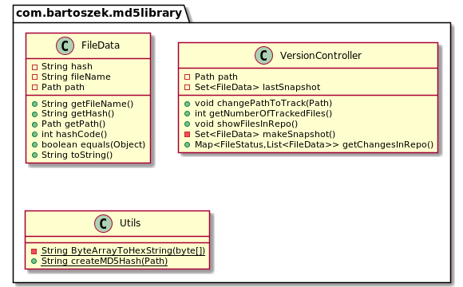

### 1.2. com.bartoszek.md5library (moduł ApplicationLibrary - JUnit Tests)

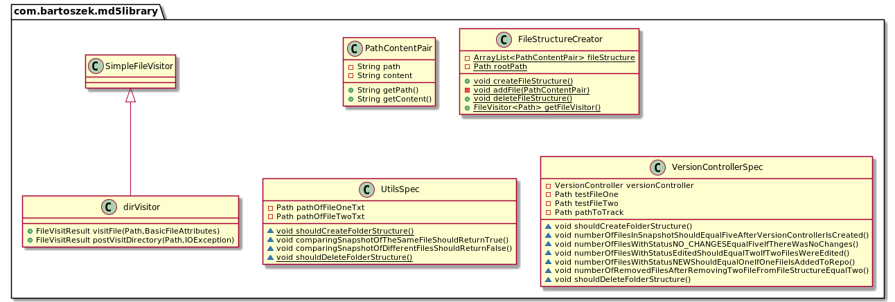

### 1.3. com.bartoszek.consoleapp (moduł ConsoleApp)

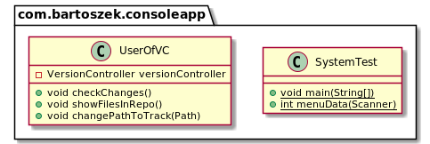

### 1.4. com.bartoszek.desktopapp (moduł DesktopApp)

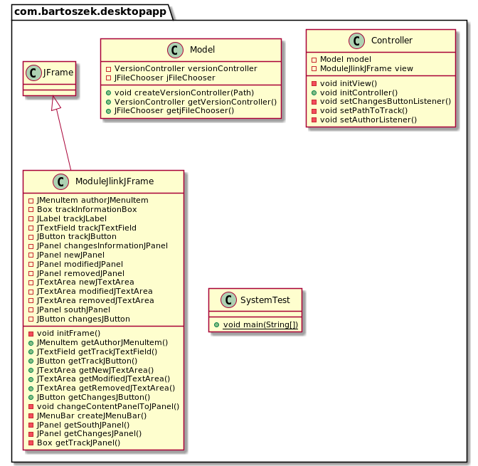

## 2. Generowanie modularnych plików jar

Do implementacji zadania utworzono projekt maven'owy w celu uniknięcia ręcznego procesu kompilacji klas oraz tworzenia modularnych plików jar. Projekt składa się z trzech modułów (```ApplicationLibrary, ConsoleApp, DesktoApp```), które są dziećmi modułu ```ModulesAndJlink```. ```ConsoleApp``` oraz ```DesktopApp``` zależą od ```ApplicationLibrary```. Maven automatycznie tworzy pliki skompilowane pliki klas w lokalizacji ```target/``` przy użyciu odpowiedniej komendy mavena dla każdego modułu. W tym przetestuję różne możliwości kompilowania kodu źródłowego i tworzenia na ich podstawie modularnych plików jar.

- za pomocą konsoli
- przy użyciu IntelliJ
- za pomocą narzędzia maven

### 2.1. Konsola

#### 2.1.1. Moduł ApplicationLibrary

Struktura programu wygląda następująco.

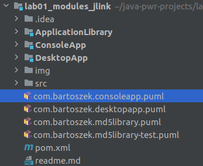

W pierwszej kolejności skompiluję klasy znajdujące się w module ```ApplicationLibrary``` od, którego zależą moduły ```ConsoleApp``` oraz ```DesktopApp```. Struktura modułu ```ApplicationLibrary``` wygląda następująco.

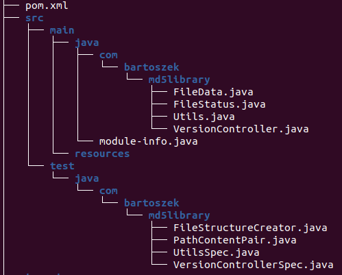

Jest to struktura plików powstała przy użyciu narzędzia maven. Maven kompiluje pliku źródłowe do folderu ```/target``` w danym module. Pliki jar są umieszczane w folderach docelowych w ```~/.m2/repository``` w zależności od konfiguracji pliku ```settings.xml``` znajdującego się w lokalizacji ```~/.m2``` (ubuntu).

Struktura plików wygląda w sposób nastepujący.

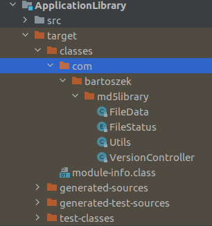

W tym podpunkcie utworzę podobną strukturę przy użyciu komend ```javac``` oraz ```jar```.
Docelowa struktura wygląda w sposób następujący.

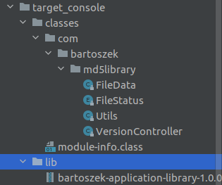

Znajdując się w folderze głównym ```ApplicationLibrary``` tworzę foldery do przechowywania plików klas oraz pliku jar.

```bash
mkdir -p target_console/classes target_console/lib
```

Kompiluję pliki źródłowe do wcześniej utworzonych folderów

```bash
javac -d target_console/classes/ src/main/java/module-info.java 
javac -d target_console/classes/ src/main/java/com/bartoszek/md5library/*
```

Następnie tworzę modularny plik jar

```bash
jar --create --file target_console/lib/bartoszek-application-library-1.0.0.jar -C target_console/classes/ .
```

#### 2.1.2. Moduł ConsoleApp

W analogiczy sposób jak w podpunkcie powyżej tworzę strukturę ```target_console/```. Wersja finalna wygląda następująco.

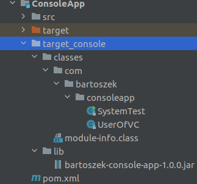

Ponieważ moduł ```ConsoleApp``` jest zależny od modułu ```ApplicationLibrary``` w procesie kompilacji dołączam wcześniej utworzony modularny plik jar.

```bash
mkdir -p target_console/classes target_console/lib

javac -d target_console/classes/ --module-path ../ApplicationLibrary/target_console/lib/  src/main/java/module-info.java
javac -d target_console/classes/ --module-path ../ApplicationLibrary/target_console/lib/  src/main/java/com/bartoszek/consoleapp/*

jar --create --file target_console/lib/bartoszek-console-app-1.0.0.jar -C target_console/classes/ .
```

#### 2.1.3. Moduł DesktopApp

Znajdując się w folderze głównym modułu ```DesktopApp``` użyto następujących komend.

```bash
javac -d target_console/classes/ --module-path ../ApplicationLibrary/target_console/lib/ src/main/java/module-info.java src/main/java/com/bartoszek/desktopapp/*

jar --create --file target_console/lib/bartoszek-desktop-app-1.0.0.jar --main-class com.bartoszek.desktopapp.SystemTest -C target_console/classes/ .
```

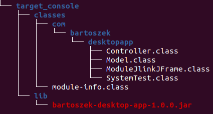

### 2.2. IntelliJ

Tworzenie modularnych plików w IntelliJ jest wykonywane za pomocą gui.

Postępowano zgodnie z dokumentacją na stronie <https://www.jetbrains.com/help/idea/compiling-applications.html#package_into_jar>. Dodatkowo istnieje możliwość utworzenia skryptu uruchomiającego moduły ```DesktoApp``` lub ```ConsoleApp``` w **"run configurations"** (automatycznie dodaje moduł ApplicationLibrary do --module-path).

Struktura folderów w głównym folderze projektu ```lab01_modules_jlink``` po wykonaniu instrukcji z dokumentacji.

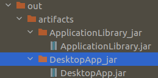

Aplikację można uruchomić w następujący sposób.

```bash
marcin:~/java-pwr-projects/lab01_modules_jlink(main)$ java --module-path out/artifacts/ApplicationLibrary_jar:out/artifacts/DesktopApp_jar --module DesktopApp/com.bartoszek.desktopapp.SystemTest
```

Intellij nie używa narzędzia jar do generowania plików jar. Dlatego w pliku ```module-info.class``` brakuje atrybutu ```ModuleMainClass```. Problem przedstawiono w wątku <https://stackoverflow.com/questions/59117333/how-can-i-set-the-modulemainclass-attribute-of-a-jpms-module-using-gradle>

Więcej przykładów dotyczących uruchomienia znajduje się w punkcie *Uruchomienie*.

### 2.3. Maven

Projekt składa się z 4 modułów maven'owych (rodzic, 3 dzieci). Każdy z nich jest modularny (zawiera module.info). Aby było możliwe skompilowania modułów, które zależą od innych modułów w projekcie, użyto ```maven-compiler-plugin``` w wersji ``3.10.0``. Moduł ```ApplicationLibrary``` zawiera testy jednostkowe. Napisane testy jednostkowe kończą się końcówką "Spec". Aby umożliwić maven'owi ich uruchomienie, w "parent pom.xml" skonfigurowano plugin ```maven-surefire-plugin```.

```pom
        <pluginManagement>
            <plugins>
                <plugin>
                    <groupId>org.apache.maven.plugins</groupId>
                    <artifactId>maven-surefire-plugin</artifactId>
                    <configuration>
                        <includes>**/*Spec.java</includes>
                    </configuration>
                    <version>2.22.2</version>
                </plugin>
            </plugins>
        </pluginManagement>
```

Pakiety w module ```ApplicationLibrary``` nie są otwarte. Dlatego w pliku ```pom.xml``` tego modułu skonfigurowano plugin ```maven-surefire-plugin```. Konfiguracja umożliwia otwarcie pakietów w *runtime*.

```pom
    <build>
        <plugins>
            <plugin>
                <artifactId>maven-surefire-plugin</artifactId>
                <configuration>
                    <argLine>--add-opens ApplicationLibrary/com.bartoszek.md5library=ALL-UNNAMED</argLine>
                </configuration>
            </plugin>
        </plugins>
    </build>
```

Po skonfigurowaniu plików ```pom.xml``` projekt uruchomiono komendą ```mvn install```. Komenda pozwala zyskać artefakty projektu i zainstalować je w lokalnym repozytorium mavena.

## 3. Uruchomienie

Przedstawiono sposoby uruchomienia aplikacji za pomocą konsoli, mavena oraz programu IntelliJ.

### 3.1. konsola

Zawarto przykłady użycia programu za pomocą zainstalowanego JDK oraz utworzonego środowiska uruchomieniowego.

#### 3.1.1. ConsoleApp

Aby uruchomić program bez tworzenia własnego środowiska uruchomieniowego wykonano nastepujące kroki.
Z folderu głównego projektu (```lab01_modules_jlink```) użyto polecenia ```java```. Zakładam, że odpowiednie modularne pliki jar zostały utworzone w poprzednim punkcie.

```bash
java --module-path ApplicationLibrary/target_console/lib:ConsoleApp/target_console/lib --module ConsoleApp/com.bartoszek.consoleapp.SystemTest
```

W konsoli widać wynik działania programu bez gui.

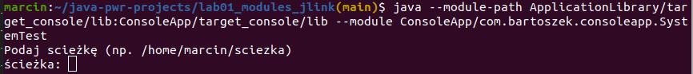

#### 3.1.2. ConsoleApp-jlink

Aby stworzyć minimalne środowisko uruchomieniowe użyto komendy jlink z głównego folder aplikacji
```lab01_modules_jlink```.

```bash
marcin:~/java-pwr-projects/lab01_modules_jlink(main)$ jlink --module-path /usr/lib/jvm/java-11-openjdk-amd64/jmods/:ApplicationLibrary/target_console/lib/bartoszek-application-library-1.0.0.jar:ConsoleApp/target_console/lib/bartoszek-console-app-1.0.0.jar --add-modules ConsoleApp --output console_app_custom_runtime --launcher conapp=ConsoleApp/com.bartoszek.consoleapp.SystemTest
```

W celu sprawdzenia ile modułów zawiera wygenerowane środowisko użyto

```bash
marcin:~/java-pwr-projects/lab01_modules_jlink(main)$ console_app_custom_runtime/bin/java --list-modules 
ApplicationLibrary
ConsoleApp
java.base@11.0.13
```

Istnieje możliwość uruchomienia programu na dwa sposoby

- za pomocą komendy java z utworzonego środowiska uruchomieniowego
- za pomocą skryptu utworzonego przy użyciu komendy jlink

```bash
marcin:~/java-pwr-projects/lab01_modules_jlink(main)$ console_app_custom_runtime/bin/java --module ConsoleApp/com.bartoszek.consoleapp.SystemTest
Podaj scieżkę (np. /home/marcin/sciezka)
ścieżka: 
```

Środowisko uruchomieniowe zadbało o ustawienie ```--module-path```

Za pomocą skryptu ```conapp``` program został uruchomiony w sposób następujacy.

```bash
marcin:~/java-pwr-projects/lab01_modules_jlink(main)$ console_app_custom_runtime/bin/conapp
Podaj scieżkę (np. /home/marcin/sciezka)
ścieżka: 
```

#### 3.1.3. DesktopApp

Jak w poprzednim podpunkcie zakładam, że modularne pliki jar, które umieszczam na ścieżce modułów zostały utworzone.

```bash
java --module-path ApplicationLibrary/target_console/lib:DesktopApp/target_console/lib --module DesktopApp
```

Po wykonaniu komendy zostaje wyświetlony graficzny interfejs użytkownika. Komenda nie wymagała podania klasy zawierającej metodę ```main```, gdyż została ona zdefiniowana w manifeście modułu ```DesktopApp``` podczas tworzenia modułu.

#### 3.1.4. DesktopApp-jlink

W sposób analogiczny jak dla podpunktu ```ConsoleApp-jlink``` tworze środowisko uruchomieniowe przy użyciu programu ```jlink```.

```bash
marcin:~/java-pwr-projects/lab01_modules_jlink(main)$ jlink --module-path /usr/lib/jvm/java-11-openjdk-amd64/jmods/:ApplicationLibrary/target_console/lib/bartoszek-application-library-1.0.0.jar:DesktopApp/target_console/lib/bartoszek-desktop-app-1.0.0.jar --add-modules DesktopApp --output desktop_app_custom_runtime --launcher desktopapp=DesktopApp
```

Sprawdzam moduły zawarte w utworzonym w środowisku uruchomieniowym.

```bash
marcin:~/java-pwr-projects/lab01_modules_jlink(main)$ desktop_app_custom_runtime/bin/java --list-modules
ApplicationLibrary
DesktopApp
java.base@11.0.13
java.datatransfer@11.0.13
java.desktop@11.0.13
java.prefs@11.0.13
java.xml@11.0.13
```

Uruchomienie na dwa sposoby:

```bash
marcin:~/java-pwr-projects/lab01_modules_jlink(main)$ desktop_app_custom_runtime/bin/java --module DesktopApp
```

lub

```bash
marcin:~/java-pwr-projects/lab01_modules_jlink(main)$ desktop_app_custom_runtime/bin/desktopapp 
```

### 3.2. konsola z SecurityManager

W rozdziale przedstawiono użycie SecurityManagera wraz z plikiem polityki przy użyciu konsoli.

#### 3.2.1. DesktopApp

Po wykonaniu poleceń mavena ```mvn clean install``` z głównego folderu projektu ```lab01_modules_jlink```, w konsoli użyto polecenia ```java``` z następującymi argumentami.

```bash
java -Djava.security.manager -Djava.security.policy=DesktopApp/src/main/resources/java.policy --module-path ApplicationLibrary/target/classes/:DesktopApp/target/classes/ --module DesktopApp/com.bartoszek.desktopapp.SystemTest
```

```-Djava.security.manager``` informuje o użyciu SecurityManagera. Plik polityki wskazywany jest za pomocą opcji ```-Djava.security.policy```.

Użyty plik polityki zezwala na wszystkie uprawnienia, jednak w projekcie wystarczą uprawnenia czytania i pisania dla komponentu ```JFileChooser```.

## 4. Przypadek użycia (dodawanie, modyfikacja usuwanie)

Folder ```lab01```, który będę śledził w aplikacji składa się z następujących plików

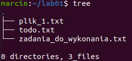

Wybieram w aplikacji folder do śledzenia.

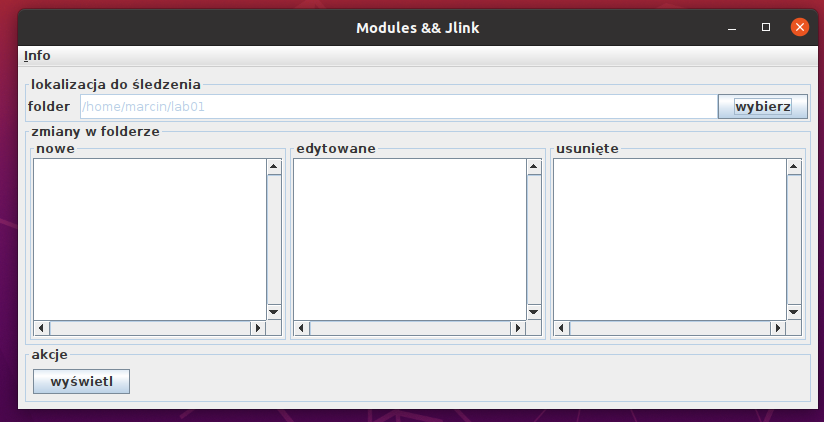

Następnie usuwam **plik_1.txt**, edytuję plik  **todo.txt** oraz dodaje plik **nowy.txt**

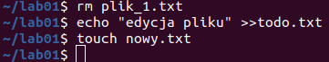

Po wciśnięciu przycisku wyświetl w aplikacji są pokazane zmiany w folderze.

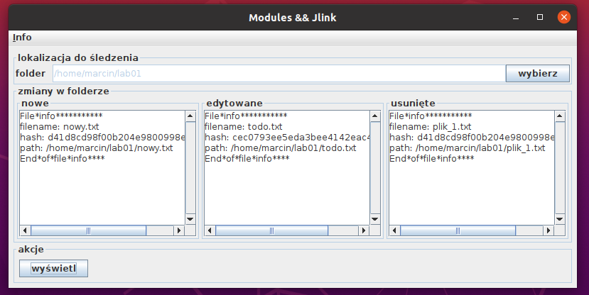