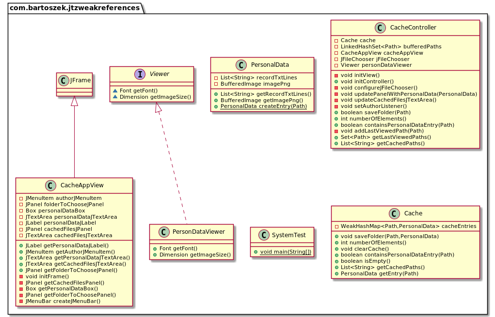
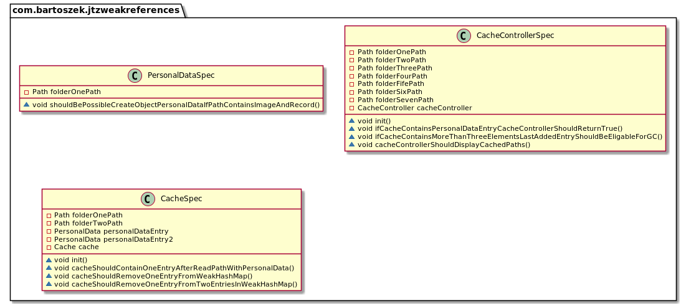
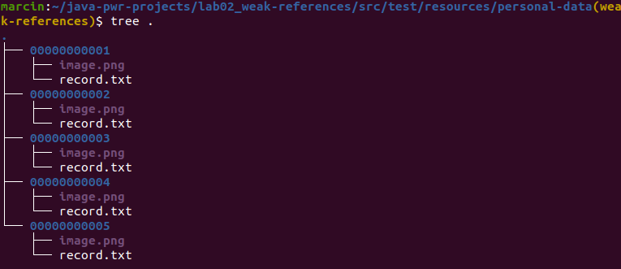
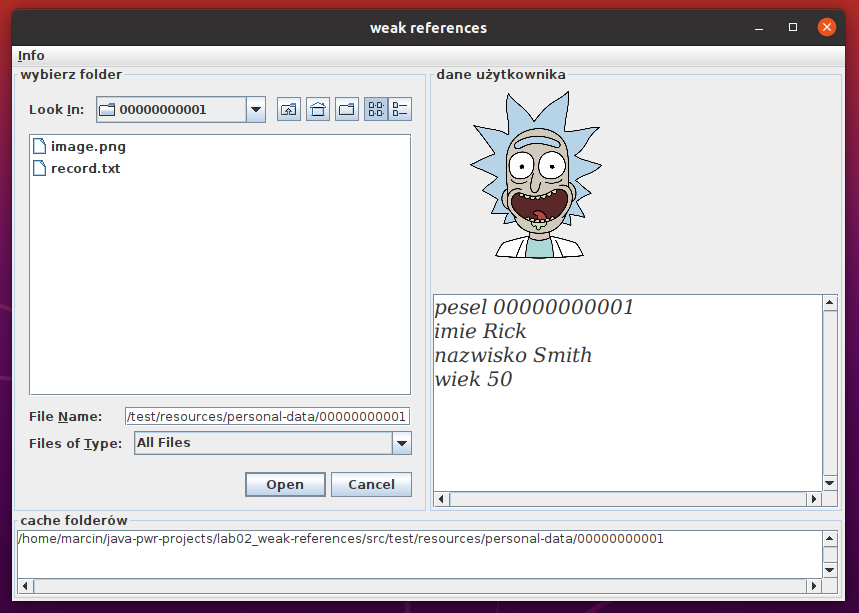
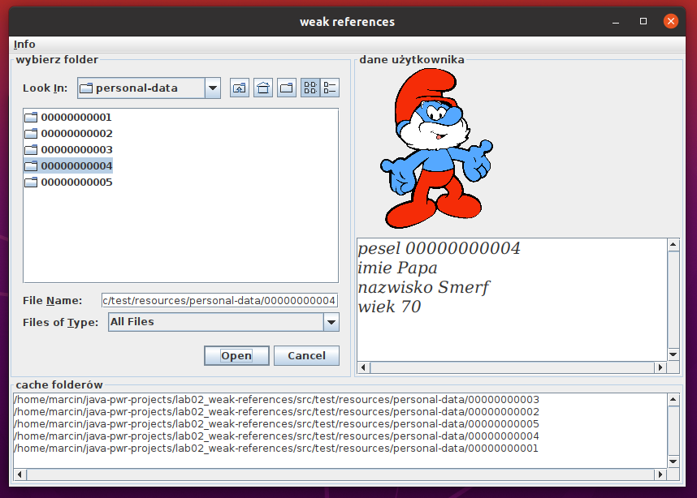
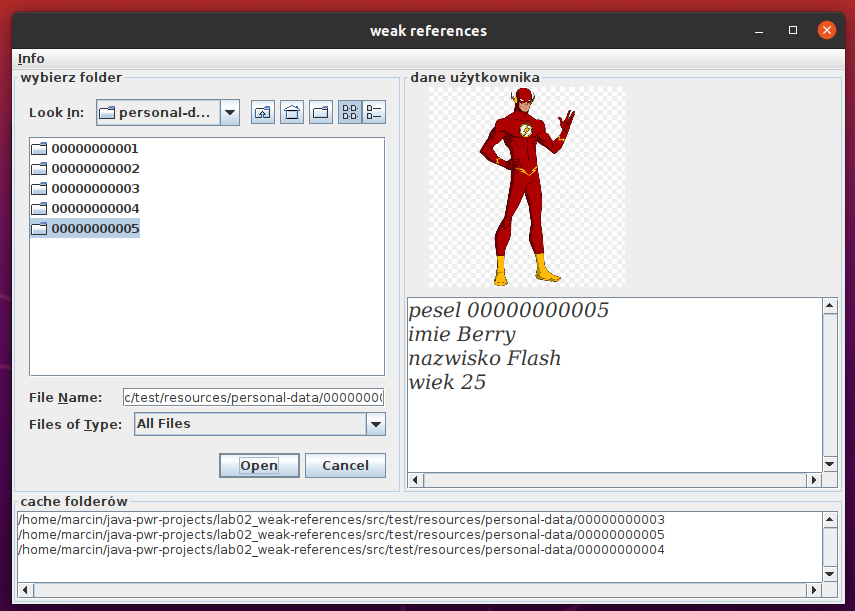

# lab02_weak_references <!-- omit in toc -->

- [1. Diagramy klas w poszczególnych pakietach](#1-diagramy-klas-w-poszczególnych-pakietach)
  - [1.1. com.bartoszek.jtzweakreferences (moduł bartoszek.jtzweakreferences)](#11-combartoszekjtzweakreferences-moduł-bartoszekjtzweakreferences)
  - [1.2. com.bartoszek.jtzweakreferences (moduł bartoszek.jtzweakreferences - jUnit tests)](#12-combartoszekjtzweakreferences-moduł-bartoszekjtzweakreferences---junit-tests)
- [2. Działanie](#2-działanie)
- [3. Uruchomienie](#3-uruchomienie)
- [4. Instrukcja obsługi](#4-instrukcja-obsługi)

## 1. Diagramy klas w poszczególnych pakietach

### 1.1. com.bartoszek.jtzweakreferences (moduł bartoszek.jtzweakreferences)



### 1.2. com.bartoszek.jtzweakreferences (moduł bartoszek.jtzweakreferences - jUnit tests)



## 2. Działanie

Dane osoby są opakowane w strukturę ```PersonalData```. Składa się ona z obrazka i danych tekstowych. W celu zaimplementowania prostego cache użyto struktury ```WeakHashMap```. Kluczem jest ścieżka do folderu zawierającego dane osoby, a wartością opakowane dane (```PersonalData```) z wskazanego folderu. ```WeakHashMap``` wewnętrznie jest zaimplementowane przy użyciu ```WeakReference```. W przypadku gdy do klucza nie ma żadnej twardej referencji, przy uruchomieniu wątku ```Garbage Collectora``` przez ``VM`` czyszczone są słabe referencje do przechowywanych obiektów. Dane są nadają się do usunięcia ze struktury ```WeakHashMap```. W następnych cyklach uruchomienia ```Garbage Collectora``` pamięć zajmowana przez te obiekty może zostać zwolniona.

W programie w celu dłuższego przechowywania obiektów klucze trzech ostatnich elementów dodanych do ```WeakHashMap``` są przechowane w zbiorze (strong references).

## 3. Uruchomienie

Po uruchomieniu polecenia mavena ```mvn install``` z głównego folderu jest tworzony "fat jar" o nazwie ```jtz-weak-references-1.0-SNAPSHOT-jar-with-dependencies.jar``` w ścieżce ```${root}/target```

W celu uruchomienia wykonalnego pliku jar należy wpisać w konsoli ```java -jar jtz-weak-references-1.0-SNAPSHOT-jar-with-dependencies.jar```

## 4. Instrukcja obsługi

Z projektem dołączone są pliki do testowania.



```record.txt``` zawiera dane osoby, ```image.png``` zdjęcie osoby.

Po wybraniu folderu zawierającego odpowiednie pliki dane są renderowane na panelu. Do skalowania obrazków użyto biblioteki ```imgscalr-lib```



Po wybraniu kilku folderów widać, że coraz więcej elementów jest w cache.



Po pewnym czasie elementy, które nie mają żadnych referencji są usuwane.

