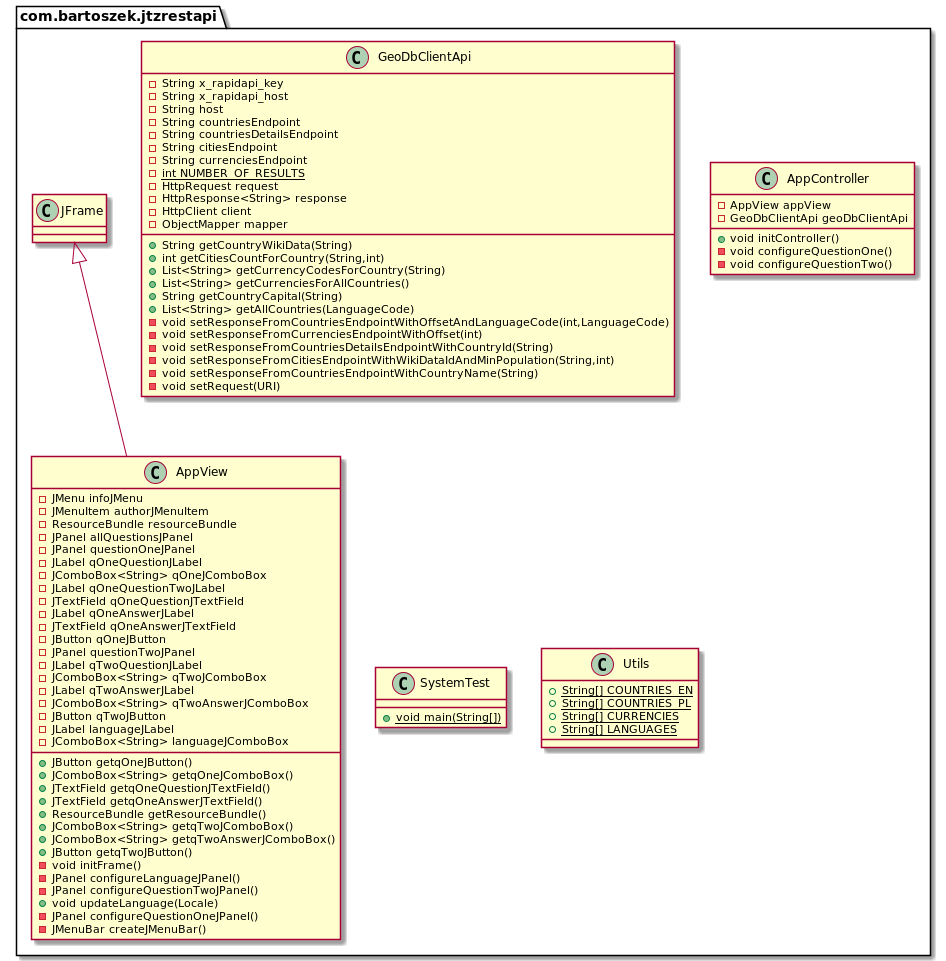
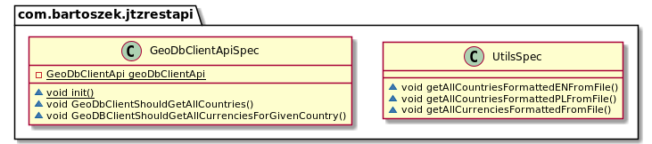
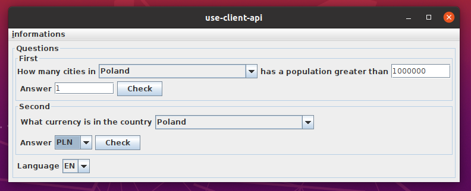
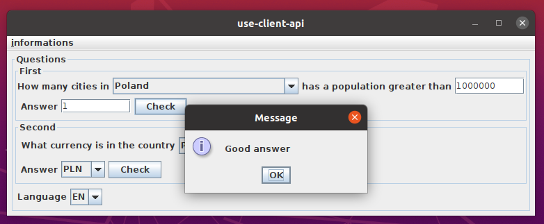
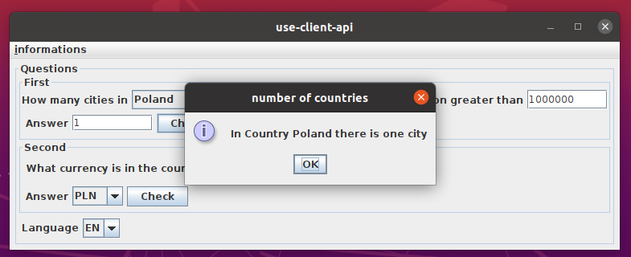
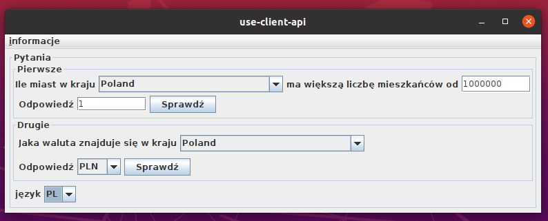
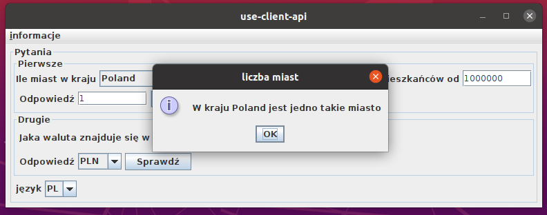

# lab03_client_api <!-- omit in toc -->

- [1. Diagramy klas w pakietach](#1-diagramy-klas-w-pakietach)
  - [1.1. com.bartoszek.jtz.rest.api (app)](#11-combartoszekjtzrestapi-app)
  - [1.2. com.bartoszek.jtz.rest.api (test)](#12-combartoszekjtzrestapi-test)
- [2. Implementacja](#2-implementacja)
- [3. Uruchomienie](#3-uruchomienie)
- [4. Przypadek użycia](#4-przypadek-użycia)

## 1. Diagramy klas w pakietach

### 1.1. com.bartoszek.jtz.rest.api (app)



### 1.2. com.bartoszek.jtz.rest.api (test)



## 2. Implementacja

Klasa ```GeoDbApiClient``` wysyła zapytania do endpoint'ów. API nie zawiera ```languageCode``` umożliwiającego zadawania zapytań w języku polskim. W aplikacji nie mapowano nazw krajów z języka angielskiego na polski. Projekt zrealizowano w architekturze MVC. Widok zawiera obiekt typu ```ResourceBundle```, który przechowuje informacje dotyczące języka. Jest również odpowiedzialny za ponowne renderowanie komponentów w przypadku zmiany języka. API pozwala na zadawanie 1000 zapytań dziennie z częstotliwością jednej sekundy. W aplikacji uwzględnioniono renderowanie tekstu z wariantami - ```ChoiceFormat```.

## 3. Uruchomienie

Należy wyksportować klucz ```API``` do zmiennej systemowej o nazwie ```GEODB_API_KEY```.

W przypadku systemu ubuntu wpisać

```vim /etc/environment```

i dodać ```GEODB_API_KEY=_wartość_klucza```

Po uruchomieniu polecenia mavena ```mvn install``` z głównego folderu jest tworzony "fat jar" o nazwie ```jtz-rest-api-1.0-SNAPSHOT-jar-with-dependencies.jar``` w ścieżce ```${root}/target```

W celu uruchomienia wykonalnego pliku jar należy wpisać w konsoli ```java -jtz-rest-api-1.0-SNAPSHOT-jar-with-dependencies.jar```

## 4. Przypadek użycia

Główne okno aplikacji 



W przypadku odpowiedzi na pytanie pojawiają okna dialogowe informujące o poprawności i prawidłowym wyniku.





Poniżej  ten sam przykład przy zmianie języka na polski



