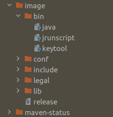
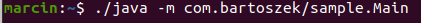
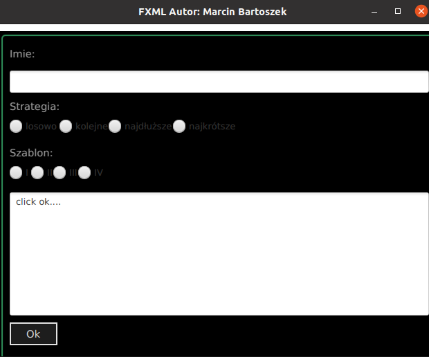

# JavaFX

## Wykonane zadania

Stworzono projekt "maven" o następującej konfiguracji.

```pom

<dependencies>
        <dependency>
            <groupId>org.openjfx</groupId>
            <artifactId>javafx-controls</artifactId>
            <version>15.0.1</version>
        </dependency>
        <dependency>
            <groupId>org.openjfx</groupId>
            <artifactId>javafx-fxml</artifactId>
            <version>15.0.1</version>
        </dependency>
    </dependencies>
    <build>
        <plugins>

            <plugin>
                <groupId>org.apache.maven.plugins</groupId>
                <artifactId>maven-compiler-plugin</artifactId>
                <version>3.8.0</version>
                <configuration>
                    <release>11</release>
                </configuration>
            </plugin>
            <plugin>
                <groupId>org.openjfx</groupId>
                <artifactId>javafx-maven-plugin</artifactId>
                <version>0.0.4</version>
                <configuration>
                    <mainClass>sample.Main</mainClass>
                </configuration>
            </plugin>
        </plugins>
    </build>

```

## W celu stworzenia wersji dystrybucyjnej

użyto polecenia ```mvn javafx:jlink```



Program jest uruchamiany w następujący sposób



## Interfejs programu



